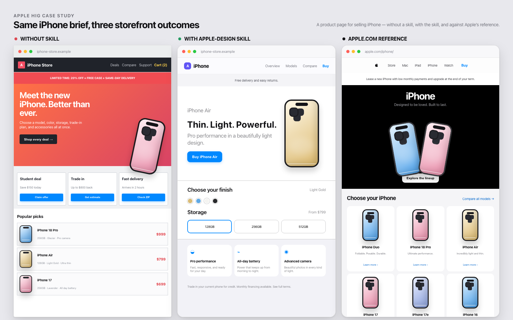

# apple-design

[English](README.md) · [ไทย](README.th.md)

A Claude Code and Codex skill that turns Apple's [Human Interface
Guidelines](https://developer.apple.com/design/human-interface-guidelines) into something an
agent can actually use: a reference to build against, and a checklist to review against.

The HIG is 170+ pages behind a JavaScript single-page app. This condenses it, and adds the
parts Apple publishes only as pictures or not at all — exact system color values, the full
Dynamic Type ladder, and a HIG→CSS mapping for web work.

## Example: same product brief, three storefront outcomes

The screenshot below is rendered from [`examples/iphone-comparison.html`](examples/iphone-comparison.html).
It compares a production-style iPhone storefront built without a design reference, with the
`apple-design` skill, and against the current structure of [Apple's iPhone page](https://www.apple.com/iphone/).
The middle version applies product focus, restrained navigation, clear model/finish/storage
choices, semantic grouping, accessible contrast, and one primary purchase action.



The third column is a local abstraction of Apple.com, not an official Apple screenshot or a
copy of Apple's product assets.

---

## Install

### Claude Code

```sh
git clone <this-repo> ~/src/apple-design-skill
ln -s ~/src/apple-design-skill ~/.claude/skills/apple-design
```

Verify it's registered:

```sh
ls -l ~/.claude/skills/apple-design/SKILL.md
```

Claude Code picks it up on the next session. It loads automatically when a task involves
Apple design, or on demand with `/apple-design`.

### Codex

```sh
ln -s /Users/<you>/src/apple-design-skill /Users/<you>/.codex/skills/apple-design
```

Codex picks it up in a new session. Invoke it with `$apple-design` or by mentioning
`apple-design` in the task. Codex does not require a separate copy of the reference files.

## Companion skills

`apple-design` is the design authority. Use these companion skills only when the task needs
their specific capability; they are separate from this repo and should not be duplicated here.

| Task branch | Companion skill | What it adds |
|---|---|---|
| Explore a flow or state model before implementation | `$prototype` | Throwaway UI/state prototype |
| Build an interactive mockup, simulator, or visual comparison | `$visualize` | Runnable visual exploration |
| Inspect a rendered web page or local HTML/CSS | `$browser:control-in-app-browser` | Browser interaction and visual QA |
| Verify current Apple guidance or gather primary-source facts | `$research` | Cited research artifact |
| Review UI/code changes against repo standards and spec | `$code-review` | Standards and spec review |

Typical workflow:

```text
$apple-design + $prototype       # settle the UI direction
$apple-design + $visualize       # make the behavior visible
$apple-design + $browser:control-in-app-browser  # inspect the rendered result
$apple-design + $code-review      # audit the final change
```

---

## What's in it

```
SKILL.md                      entry point — the non-negotiables and a routing table
references/
  foundations.md              type, color, materials, layout, accessibility, motion, dark mode
  foundations-extended.md     branding, images, immersive experiences, spatial layout
  components.md               every HIG component, condensed to its rules
  patterns.md                 onboarding, feedback, loading, modality, search, settings…
  platforms.md                iOS / iPadOS / macOS / watchOS / tvOS / visionOS deltas
  inputs.md                   gestures, keyboards, pointer, focus, Crown, gaze, Pencil, controllers
  technologies.md              complete index of current HIG technology pages
  coverage.md                  generated inventory of every current HIG topic and local entry point
  app-icons.md                layers, Icon Composer, appearances, per-platform specs
  web-mapping.md              what each native rule becomes in HTML and CSS
  checklist.md                the review checklist, accessibility as a hard gate
assets/
  apple-tokens.css            drop-in tokens: system colors, type scale, glass, motion
  type-scales.md              the full Dynamic Type tables, xSmall through AX5
examples/
  settings.html               runnable demo — iOS grouped-settings screen on the tokens
  comparison.html             production-scale before/after dashboard comparison
  iphone-comparison.html      iPhone storefront comparison against the Apple.com structure
scripts/
  refresh-hig.py              re-crawl Apple and regenerate the derived references and indexes
  preview.sh                  screenshot the demo in both appearances (headless Chrome)
```

Nothing loads all of it. `SKILL.md` is small and holds a routing table; the agent opens only
the reference the task needs.

---

## Usage

### 1. Building UI — the skill fires on its own

```
> build a settings screen for the iOS app, grouped list style
```

<details>
<summary>What the skill makes the agent do</summary>

1. Reads the **non-negotiables** in `SKILL.md`.
2. Opens `references/platforms.md` → iOS: 17 pt body, 44 pt targets, 16 pt gutter, no
   full-width buttons, keep the status bar.
3. Opens `references/components.md` → *Lists and tables*, *Toggles*, *Buttons* before
   building each one.
4. Opens `references/patterns.md` → *Settings*: settings hold preferences people change
   rarely, not the app's actual controls.
5. Runs `references/checklist.md` before saying it's done.

</details>

### 2. Reviewing an existing UI

In Claude Code, invoke it explicitly with `/apple-design`; in Codex, use `$apple-design` or
mention `apple-design` in the task.

```
> /apple-design review src/screens/Checkout.tsx against the HIG
```

The agent walks `references/checklist.md` top to bottom. Section A (accessibility) is a
gate — every failure is reported. The rest is reported only where a rule actually breaks.
Findings come back in this shape:

```
[blocker] 4.5:1 contrast — Checkout.tsx:88, .price-note
  systemGray #8E8E93 on the grouped background #F2F2F7 is 2.92:1 at 13pt. Fails AA in
  light mode; dark mode happens to pass, which is why it got missed.
  → --label (or --label-secondary only if the note moves to 18pt+/semibold — that token is
    itself just 3.29:1 on this background)

[blocker] 4.5:1 contrast — Checkout.tsx:140, .btn--prominent
  White on system blue #0088FF is 3.52:1, and the label is 17pt Regular.
  → make the label semibold (3:1 threshold applies), or use the Increase-Contrast blue
    #1E6EF4 (4.57:1) as the resting color

[defect] one prominent button per view — Checkout.tsx:140–152
  "Apply Coupon" and "Pay Now" are both filled accent buttons, so neither reads as the
  primary action.
  → keep Pay Now prominent, drop Apply Coupon to .btn (tinted, accent label)

[defect] press state — Checkout.tsx:140
  Custom button has :hover but no :active. The HIG calls this out specifically: without a
  press state a button feels unresponsive.
  → :active { opacity: .6; transform: scale(.97) }

[polish] destructive default — Checkout.tsx:171
  "Remove item" is red and is also the default button. Red is right; default is not.
```

### 3. Web or Artifact work with an Apple look

```
> build a pricing page that feels like an Apple product page
```

The agent reads `references/web-mapping.md` and starts from `assets/apple-tokens.css`:

```html
<link rel="stylesheet" href="assets/apple-tokens.css">
```

```css
.hero-title {
  font: var(--text-large-title);          /* 34px / 41px, the iOS Large Title */
  letter-spacing: var(--ls-large-title);  /* +0.40px — SF is positively tracked above 24pt */
}

.site-header {                            /* Liquid Glass, navigation layer only */
  position: sticky; top: 0;
  background: var(--glass-bg);
  backdrop-filter: var(--glass-blur);
  border-bottom: 0.5px solid var(--glass-border);
}

.card {                                   /* content layer — standard material, never glass */
  background: var(--bg-grouped-secondary);
  border-radius: var(--r-lg);
}
```

Light, dark, Increase Contrast, Reduce Transparency, and Reduce Motion are already wired
into the token file. `--accent` is the one thing you're expected to override.

Open `examples/settings.html` in a browser to see the whole thing working:

```sh
open examples/settings.html
```

### 4. Asking a direct question

```
> what's the iOS Headline text style?
> what's the exact hex for system green in dark mode?
> minimum touch target on visionOS?
```

Answers come out of `references/foundations.md` — Headline is 17 pt Semibold / 22 pt
leading, system green dark is `#30D158`, visionOS wants 60×60 pt. No web fetch, no guessing.

### 5. Using the reference outside Claude Code

The files are plain Markdown and plain CSS. They work fine as a design-system reference for
a human, in a Figma spec, or dropped into another tool's context.

---

## Where the numbers come from

Apple's documentation site renders from a JSON API at
`developer.apple.com/tutorials/data/<route>.json`. `scripts/refresh-hig.py` walks it,
converts each page to Markdown, and condenses the "best practice" headings into
`components.md` and `patterns.md`.

System colors are the interesting case: the HIG publishes them as swatch **images**, not as
text. The script downloads each swatch and samples its center pixel, which is how this repo
has exact hex values for all twelve system colors and six grays across light, dark, and both
increased-contrast variants.

```
Red     light #FF383C   dark #FF4245   AX-light #E9152D   AX-dark #FF6165
Blue    light #0088FF   dark #0091FF   AX-light #1E6EF4   AX-dark #5CB8FF
Green   light #34C759   dark #30D158   AX-light #008932   AX-dark #4AD968
…
```

The hand-written files are never overwritten by the script.

---

## Refreshing

```sh
python3 scripts/refresh-hig.py            # Pillow required for color sampling
python3 scripts/refresh-hig.py --cache /tmp/hig
```

About four minutes on a cold cache, seconds on a warm one. It regenerates
`references/components.md` and `references/patterns.md` in place, and leaves every full page
as Markdown in `.hig-cache/md/` so you can diff the hand-written files against the new
source:

```sh
git diff references/
diff <(sed -n '/Dynamic Type/,/macOS built-in/p' .hig-cache/md/typography.md) …
```

---

## Caveats

- The condensed references are refreshed from Apple's HIG data; `references/coverage.md`
  records the current topic inventory and generated date.
- Apple says explicitly: **don't hard-code system colors in a native app.** Use `Color.red`
  / `UIColor.systemGray4`. The hex values here are for mockups, web work, and contrast
  checks, and they change between OS releases.
- Values the HIG doesn't publish — corner radii, blur amounts, shadows, easing curves, the
  spacing ramp — are marked *(approximation)* in `apple-tokens.css`. They are chosen to
  match the platform, not quoted from Apple.
- San Francisco and SF Symbols are licensed for Apple platforms. Don't self-host them on the
  web; `references/web-mapping.md` covers the alternatives.
- Technology guidance is indexed in `references/technologies.md` but intentionally links to
  Apple's official pages instead of copying every integration-specific rule into this repo.
  Those pages change with APIs, privacy requirements, and platform availability.
- This repo is an unofficial condensation. Apple's site is the source of truth.
