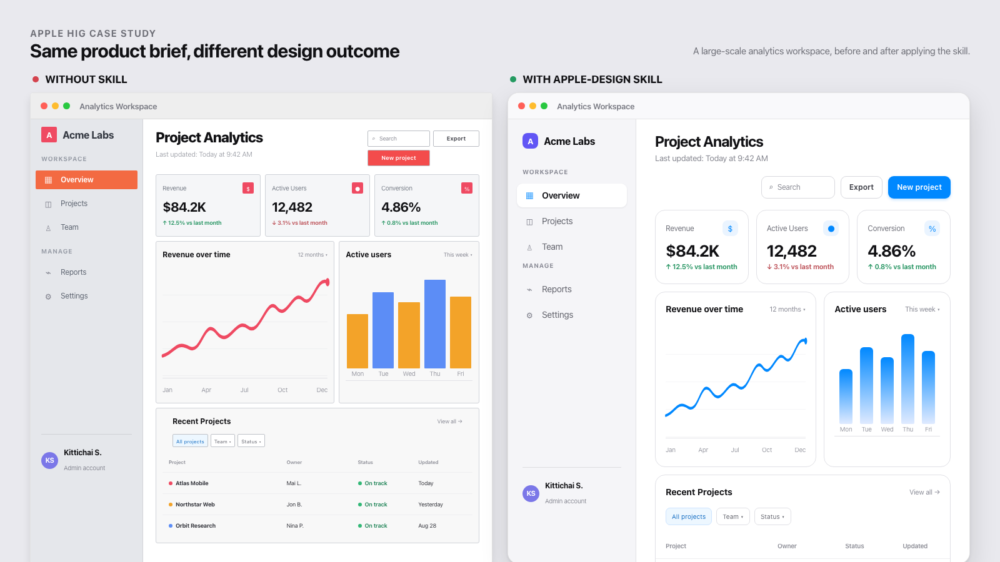

# apple-design

[English](README.md) · [ไทย](README.th.md)

สกิลสำหรับ Claude Code และ Codex ที่แปลง [Human Interface Guidelines ของ Apple](https://developer.apple.com/design/human-interface-guidelines) ให้เป็นสิ่งที่เอเจนต์นำไปใช้ได้จริง ทั้งในฐานะแหล่งอ้างอิงสำหรับการสร้างงาน และเช็กลิสต์สำหรับตรวจงาน

HIG ของ Apple มีเนื้อหามากกว่า 170 หน้าและอยู่เบื้องหลังเว็บแอปแบบ single-page ที่ใช้ JavaScript โปรเจกต์นี้สรุปเนื้อหาให้กระชับ พร้อมเพิ่มส่วนที่ Apple เผยแพร่เฉพาะเป็นรูปภาพหรือไม่ได้เผยแพร่ไว้โดยตรง เช่น ค่าสีระบบแบบระบุแน่นอน ตาราง Dynamic Type ครบชุด และการจับคู่ HIG กับ CSS สำหรับงานเว็บ

## ตัวอย่าง: หน้าจอเดียวกัน ผลลัพธ์ต่างกัน

ภาพด้านล่างเป็น screenshot ที่ render จาก [`examples/comparison.html`](examples/comparison.html) โดยตรง เปรียบเทียบ analytics workspace ระดับ production เดียวกัน ระหว่างการสร้างโดยไม่มีแหล่งอ้างอิงด้านการออกแบบ กับการใช้ `apple-design` skill ฝั่งขวาใช้ grouped layout, spacing ที่สม่ำเสมอ, hierarchy ที่ชัดเจนขึ้น, control ที่มีความหมาย, contrast ที่เข้าถึงได้ และลำดับความสำคัญของ action ที่ชัดเจน



ภาพนี้เป็นตัวอย่าง HTML ใน repository ไม่ใช่ภาพหน้าจออย่างเป็นทางการของ Apple

---

## การติดตั้ง

### Claude Code

```sh
git clone <this-repo> ~/src/apple-design-skill
ln -s ~/src/apple-design-skill ~/.claude/skills/apple-design
```

ตรวจสอบว่าลงทะเบียนแล้ว:

```sh
ls -l ~/.claude/skills/apple-design/SKILL.md
```

Claude Code จะโหลดสกิลในเซสชันถัดไปโดยอัตโนมัติเมื่อทำงานที่เกี่ยวข้องกับการออกแบบแบบ Apple หรือเรียกใช้ด้วย `/apple-design`

### Codex

```sh
ln -s /Users/<you>/src/apple-design-skill /Users/<you>/.codex/skills/apple-design
```

Codex จะตรวจพบสกิลในเซสชันใหม่ เรียกใช้ด้วย `$apple-design` หรือกล่าวถึง `apple-design` ในงานที่มอบหมาย Codex ไม่จำเป็นต้องคัดลอกไฟล์อ้างอิงแยกอีกชุด

## สกิลที่ใช้ร่วมกัน

`apple-design` เป็นแหล่งอ้างอิงหลักด้านการออกแบบ ให้ใช้สกิลเสริมต่อไปนี้เฉพาะเมื่องานต้องการความสามารถนั้นโดยตรง สกิลเหล่านี้แยกจาก repository นี้และไม่ควรคัดลอกมาไว้ที่นี่

| สาขางาน | สกิลเสริม | ความสามารถที่เพิ่มเข้ามา |
|---|---|---|
| สำรวจ flow หรือ state model ก่อนเริ่มพัฒนา | `$prototype` | ต้นแบบ UI/state แบบใช้แล้วทิ้ง |
| สร้าง mockup แบบโต้ตอบ ตัวจำลอง หรือการเปรียบเทียบภาพ | `$visualize` | การสำรวจภาพที่รันได้จริง |
| ตรวจสอบเว็บเพจหรือ HTML/CSS ที่ render แล้ว | `$browser:control-in-app-browser` | ควบคุมเบราว์เซอร์และตรวจสอบภาพ |
| ตรวจสอบคำแนะนำปัจจุบันของ Apple หรือรวบรวมข้อมูลจากแหล่งปฐมภูมิ | `$research` | งานวิจัยพร้อมแหล่งอ้างอิง |
| ตรวจ UI/code ตามมาตรฐานของ repository และข้อกำหนด | `$code-review` | การตรวจตามมาตรฐานและสเปก |

ตัวอย่าง workflow:

```text
$apple-design + $prototype       # ตกลงทิศทาง UI
$apple-design + $visualize       # ทำให้พฤติกรรมมองเห็นได้
$apple-design + $browser:control-in-app-browser  # ตรวจงานที่ render แล้ว
$apple-design + $code-review     # ตรวจงานขั้นสุดท้าย
```

---

## ภายใน repository มีอะไรบ้าง

```
SKILL.md                      จุดเริ่มต้น — ข้อกำหนดสำคัญและตารางนำทาง
references/
  foundations.md              ตัวอักษร สี วัสดุ layout accessibility motion dark mode
  foundations-extended.md     branding รูปภาพ ประสบการณ์ immersive และ spatial layout
  components.md               component ใน HIG ทุกตัว สรุปเฉพาะกฎที่จำเป็น
  patterns.md                 onboarding feedback loading modality search settings…
  platforms.md                ความแตกต่างระหว่าง iOS / iPadOS / macOS / watchOS / tvOS / visionOS
  inputs.md                   gesture keyboard pointer focus Crown gaze Pencil controller
  technologies.md             ดัชนีเทคโนโลยีทั้งหมดในหน้า HIG ปัจจุบัน
  coverage.md                 รายการหัวข้อ HIG ปัจจุบันและจุดอ้างอิงใน repository ที่สร้างขึ้น
  app-icons.md                layer, Icon Composer, appearance และสเปกของแต่ละแพลตฟอร์ม
  web-mapping.md              กฎ native แต่ละข้อแปลงเป็น HTML และ CSS อย่างไร
  checklist.md                เช็กลิสต์สำหรับตรวจงาน โดยมี accessibility เป็นเงื่อนไขบังคับ
assets/
  apple-tokens.css            token พร้อมใช้: สีระบบ type scale glass motion
  type-scales.md              ตาราง Dynamic Type ครบตั้งแต่ xSmall ถึง AX5
examples/
  settings.html               ตัวอย่างที่รันได้ — หน้าจอ settings แบบ grouped ของ iOS ที่ใช้ token
  comparison.html             ตัวอย่าง dashboard ระดับ production สำหรับเปรียบเทียบก่อน/หลัง
scripts/
  refresh-hig.py              crawl Apple ใหม่และสร้าง reference กับ index ที่ได้จากข้อมูลขึ้นใหม่
  preview.sh                  สร้างภาพตัวอย่างในทั้งสอง appearance ด้วย headless Chrome
```

ระบบจะไม่โหลดทุกไฟล์พร้อมกัน `SKILL.md` มีขนาดเล็กและทำหน้าที่เป็นตารางนำทาง เอเจนต์จะเปิดเฉพาะ reference ที่จำเป็นกับงานนั้น

---

## วิธีใช้งาน

### 1. สร้าง UI — สกิลทำงานเอง

```text
> build a settings screen for the iOS app, grouped list style
```

<details>
<summary>สิ่งที่สกิลจะทำให้เอเจนต์</summary>

1. อ่าน **ข้อกำหนดสำคัญ** ใน `SKILL.md`
2. เปิด `references/platforms.md` → iOS: body 17 pt, target 44 pt, gutter 16 pt, ไม่ใช้ปุ่มเต็มความกว้าง และคง status bar ไว้
3. เปิด `references/components.md` → *Lists and tables*, *Toggles*, *Buttons* ก่อนสร้าง component แต่ละตัว
4. เปิด `references/patterns.md` → *Settings*: settings ใช้เก็บ preference ที่ผู้ใช้เปลี่ยนไม่บ่อย ไม่ใช่ control หลักของแอป
5. รัน `references/checklist.md` ก่อนบอกว่างานเสร็จ

</details>

### 2. ตรวจสอบ UI ที่มีอยู่

ใน Claude Code ให้เรียกใช้ด้วย `/apple-design` โดยตรง ส่วน Codex ให้ใช้ `$apple-design` หรือกล่าวถึง `apple-design` ในงาน

```text
> /apple-design review src/screens/Checkout.tsx against the HIG
```

เอเจนต์จะไล่ตรวจ `references/checklist.md` ตั้งแต่ต้นจนจบ Section A (accessibility) เป็น gate — ต้องรายงานทุกข้อที่ไม่ผ่าน ส่วนที่เหลือจะรายงานเฉพาะเมื่อพบว่าผิดกฎจริง

ผลการตรวจจะมีรูปแบบประมาณนี้:

```text
[blocker] 4.5:1 contrast — Checkout.tsx:88, .price-note
  systemGray #8E8E93 บนพื้นหลัง grouped #F2F2F7 มีอัตราส่วน 2.92:1 ที่ขนาด 13pt ไม่ผ่าน AA ใน
  light mode; dark mode บังเอิญผ่าน จึงเป็นสาเหตุที่มักถูกมองข้าม
  → ใช้ --label (หรือ --label-secondary เฉพาะเมื่อ note มีขนาด 18pt+/semibold — token นั้นเอง
    มีอัตราส่วนเพียง 3.29:1 บนพื้นหลังนี้)

[blocker] 4.5:1 contrast — Checkout.tsx:140, .btn--prominent
  สีขาวบน system blue #0088FF มีอัตราส่วน 3.52:1 และ label เป็น 17pt Regular
  → ทำให้ label เป็น semibold (เกณฑ์ 3:1 ใช้กับกรณีนี้) หรือใช้ Increase-Contrast blue
    #1E6EF4 (4.57:1) เป็นสีปกติ

[defect] one prominent button per view — Checkout.tsx:140–152
  "Apply Coupon" และ "Pay Now" เป็นปุ่ม accent แบบ filled ทั้งคู่ จึงไม่มีปุ่มใดอ่านได้ว่าเป็น
  action หลัก
  → ให้ Pay Now เป็นปุ่มเด่น และลด Apply Coupon เป็น .btn (ใช้ tinted พร้อม accent label)

[defect] press state — Checkout.tsx:140
  ปุ่ม custom มี :hover แต่ไม่มี :active HIG ระบุเรื่องนี้โดยเฉพาะ: หากไม่มี press state ปุ่มจะ
  ให้ความรู้สึกไม่ตอบสนอง
  → :active { opacity: .6; transform: scale(.97) }

[polish] destructive default — Checkout.tsx:171
  "Remove item" ใช้สีแดงถูกต้อง แต่ไม่ควรเป็นปุ่ม default
```

### 3. งานเว็บหรือ artifact ที่ต้องการหน้าตาแบบ Apple

```text
> build a pricing page that feels like an Apple product page
```

เอเจนต์จะอ่าน `references/web-mapping.md` และเริ่มจาก `assets/apple-tokens.css`:

```html
<link rel="stylesheet" href="assets/apple-tokens.css">
```

```css
.hero-title {
  font: var(--text-large-title);          /* 34px / 41px, Large Title ของ iOS */
  letter-spacing: var(--ls-large-title);  /* +0.40px — SF เพิ่ม tracking เมื่อเกิน 24pt */
}

.site-header {                            /* Liquid Glass เฉพาะชั้น navigation */
  position: sticky; top: 0;
  background: var(--glass-bg);
  backdrop-filter: var(--glass-blur);
  border-bottom: 0.5px solid var(--glass-border);
}

.card {                                   /* content layer — ไม่ใช้ glass */
  background: var(--bg-grouped-secondary);
  border-radius: var(--r-lg);
}
```

light, dark, Increase Contrast, Reduce Transparency และ Reduce Motion เชื่อมต่อไว้ใน token file แล้ว สิ่งเดียวที่คาดหวังให้ override คือ `--accent`

เปิด `examples/settings.html` ในเบราว์เซอร์เพื่อดูตัวอย่างที่ทำงานครบ:

```sh
open examples/settings.html
```

### 4. ถามคำถามโดยตรง

```text
> what's the iOS Headline text style?
> what's the exact hex for system green in dark mode?
> minimum touch target on visionOS?
```

คำตอบมาจาก `references/foundations.md` — Headline คือ 17 pt Semibold / leading 22 pt, system green ใน dark mode คือ `#30D158` และ visionOS ต้องการพื้นที่กด 60×60 pt โดยไม่ต้อง fetch เว็บหรือเดาเอง

### 5. ใช้ reference นอก Claude Code

ไฟล์ทั้งหมดเป็น Markdown และ CSS ธรรมดา จึงใช้เป็น design-system reference สำหรับคน ใส่ใน Figma spec หรือนำไปเป็น context ให้เครื่องมืออื่นได้

---

## ตัวเลขมาจากไหน

เว็บไซต์เอกสารของ Apple render จาก JSON API ที่
`developer.apple.com/tutorials/data/<route>.json` โดย `scripts/refresh-hig.py` จะไล่เดินข้อมูลแต่ละหน้า แปลงเป็น Markdown และสรุปหัวข้อ "best practice" ลงใน `components.md` กับ `patterns.md`

กรณีที่น่าสนใจคือสีระบบ: HIG เผยแพร่เป็น **รูป swatch** ไม่ใช่ข้อความ สคริปต์จะดาวน์โหลด swatch แต่ละรูปและสุ่มอ่าน pixel ตรงกลาง จึงได้ค่า hex ที่แน่นอนของสีระบบทั้ง 12 สีและ gray 6 ระดับใน light, dark และ increased-contrast ทั้งสองแบบ

```
Red     light #FF383C   dark #FF4245   AX-light #E9152D   AX-dark #FF6165
Blue    light #0088FF   dark #0091FF   AX-light #1E6EF4   AX-dark #5CB8FF
Green   light #34C759   dark #30D158   AX-light #008932   AX-dark #4AD968
…
```

ไฟล์ที่เขียนขึ้นเองจะไม่ถูกสคริปต์เขียนทับ

---

## การรีเฟรชข้อมูล

```sh
python3 scripts/refresh-hig.py            # ต้องติดตั้ง Pillow เพื่อสุ่มอ่านค่าสี
python3 scripts/refresh-hig.py --cache /tmp/hig
```

การรันด้วย cache ว่างใช้เวลาประมาณสี่นาที ส่วน cache ที่มีอยู่แล้วใช้เวลาไม่กี่วินาที สคริปต์จะสร้าง `references/components.md` และ `references/patterns.md` ใหม่ในตำแหน่งเดิม และเก็บหน้าเต็มทุกหน้าเป็น Markdown ไว้ใน `.hig-cache/md/` เพื่อให้เปรียบเทียบไฟล์ที่เขียนเองกับ source ใหม่ได้:

```sh
git diff references/
diff <(sed -n '/Dynamic Type/,/macOS built-in/p' .hig-cache/md/typography.md) …
```

---

## ข้อควรทราบ

- reference แบบย่อจะรีเฟรชจากข้อมูล HIG ของ Apple ส่วน `references/coverage.md` จะบันทึกรายการหัวข้อปัจจุบันและวันที่สร้าง
- Apple ระบุไว้อย่างชัดเจนว่า **อย่าฝังค่าสีระบบแบบ hard-code ใน native app** ให้ใช้ `Color.red` / `UIColor.systemGray4` ค่า hex ใน repository นี้มีไว้สำหรับ mockup งานเว็บ และการตรวจ contrast เท่านั้น และอาจเปลี่ยนระหว่างรุ่นของ OS
- ค่าที่ HIG ไม่ได้เผยแพร่ เช่น corner radius, ระดับ blur, shadow, easing curve และ spacing ramp จะระบุว่า *(ประมาณการ)* ใน `apple-tokens.css` ค่าเหล่านี้เลือกให้เข้ากับแพลตฟอร์ม ไม่ใช่ค่าที่คัดลอกจาก Apple
- San Francisco และ SF Symbols อยู่ภายใต้สิทธิ์การใช้งานสำหรับแพลตฟอร์ม Apple อย่า self-host บนเว็บ โดย `references/web-mapping.md` จะอธิบายทางเลือกอื่น
- คำแนะนำด้านเทคโนโลยีถูกรวบรวมไว้ใน `references/technologies.md` แต่ตั้งใจให้ลิงก์ไปยังหน้าอย่างเป็นทางการของ Apple แทนการคัดลอกกฎเฉพาะของแต่ละ integration มาไว้ใน repository นี้ เพราะหน้าเหล่านั้นเปลี่ยนแปลงตาม API, ข้อกำหนดด้านความเป็นส่วนตัว และแพลตฟอร์มที่รองรับ
- repository นี้เป็นการสรุปอย่างไม่เป็นทางการ เว็บไซต์ของ Apple คือแหล่งข้อมูลหลัก
